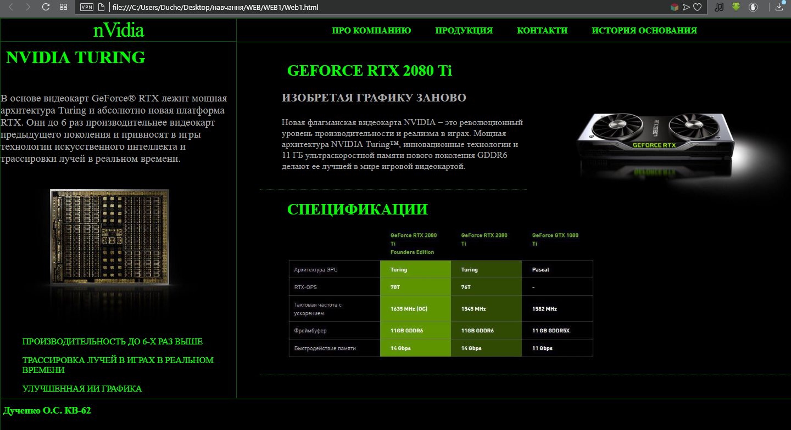
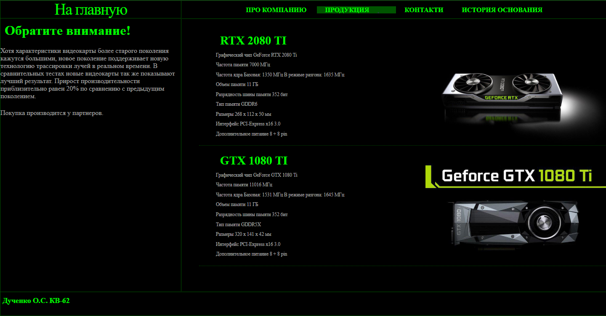
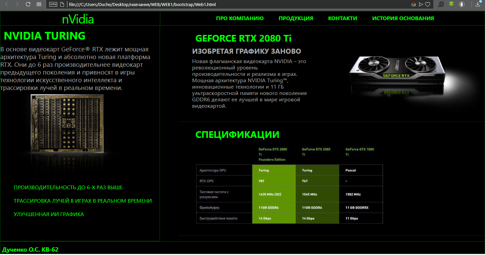
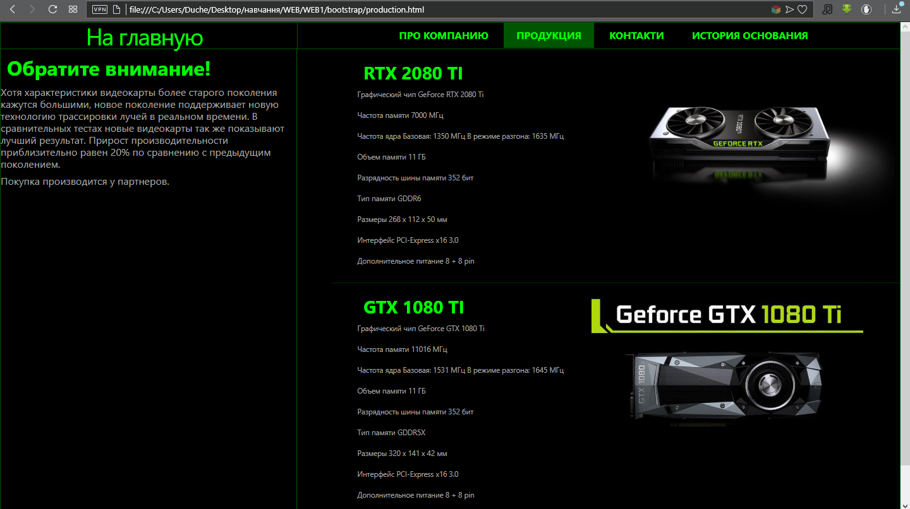

Лабораторна № 1 з Web-дизайну.

Дученко О.С. КВ-62.

Варіант 12

В корні лежать файли css версії розмітки. В папці bootstrap - версія з використанням розмітки bootstrap.

CSS-розмітка:

Bootstrap-розмітка:

